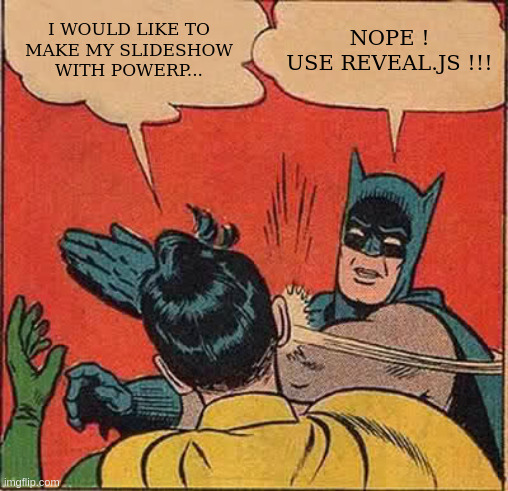

## <!-- .element: class="no-toc-progress" --> Your Title

<small>by John Doe</small>

----

### <!-- .element: class="no-toc-progress" --> Agenda

1. <!-- .element: class="fragment" --> Introduction
2. <!-- .element: class="fragment" --> Section 1
3. <!-- .element: class="fragment" --> Section 2
4. <!-- .element: class="fragment" --> Section 3
5. <!-- .element: class="fragment" --> Conclusion

----

--flowchart1--

-----

## 1. Introduction

----

### Objectives

1. <!-- .element: class="fragment" --> First objective
2. <!-- .element: class="fragment" --> Second objective
3. <!-- .element: class="fragment" --> Third objective

----

--mindmap1--

-----

## 2. Section 1

----

### Subsection

----

A non-ordered list:

- <!-- .element: class="fragment" --> First point
- <!-- .element: class="fragment" --> Second point

-----

## 3. Section 2

----

----

---quizz1---

-----

## 4. Section 3

----

--flowchart2--

----

--mindmap2--

-----

## 5. Conclusion

----

### Objectives

1. <!-- .element: class="fragment" --> First objective reached
2. <!-- .element: class="fragment" --> Second objective reached
3. <!-- .element: class="fragment" --> Third objective reached

-----

## <!-- .element: class="no-toc-progress" --> Questions ?

----

---quizz2---

-----

#### <!-- .element: class="no-toc-progress" --> References

<ul style="list-style-type:none">
<small>
<li>[1] First reference</li>
<li>[2] Second reference</li>
<li>[3] Third reference</li>
</small>
</ul>

